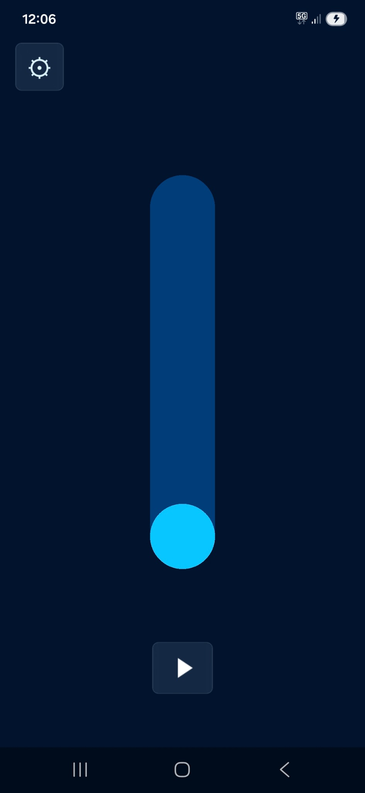
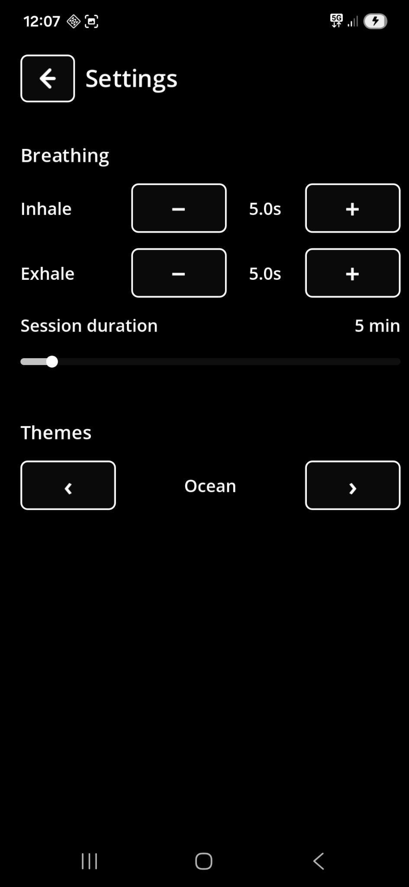

# Essential Breathing

**A calm, minimal breathing app for Android.**

Essential Breathing helps you follow a simple breathing rhythm with a clear visual guide: a ball moves up as you inhale and down as you exhale. The app is intentionally quiet and uncluttered, so you can focus on the breath rather than on menus, badges, streaks, or distractions.

  
  &nbsp;&nbsp;&nbsp;
  

## Features

- Simple visual breathing guide
- Smooth ball movement inside a vertical gauge
- Adjustable inhale duration
- Adjustable exhale duration
- Adjustable session duration
- Start, pause, resume, and stop controls
- Several visual themes
- Clean mobile layout designed for portrait mode
- Available in English, French, and Spanish
- No account required

## Why this app?

Many breathing apps try to do everything: lessons, subscriptions, statistics, gamification, social features, and a small festival of notifications.

Essential Breathing does the opposite. It keeps the experience simple: choose a rhythm, press play, and breathe.

## Status

Essential Breathing is currently a personal Android app, tested as an APK on a real phone. It is not currently published on Google Play.

## Built with

- Godot 4.6.2
- GDScript
- Android export

## Technical documentation

This README is meant to present the app in a simple, user-facing way.

More technical notes are available in:

- [`docs/current_implementation.md`](docs/current_implementation.md)
- [`docs/android_export_notes.md`](docs/android_export_notes.md)
